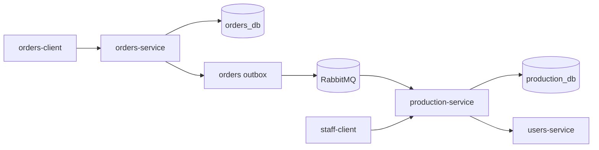

# Architecture Design

## 1. Task Summary

Design a production pipeline for restaurant orders so that:

- accepted customer orders are handed off into kitchen work automatically
- a dedicated backend service owns operational order state
- RabbitMQ carries asynchronous production events
- staff can use a dedicated web app to pick up and complete work item by item

The design extends the existing `orders-service` and `users-service` without moving order ownership away from the current submission flow.

## 2. Problem Statement

The current platform stops at `orders-service` returning `ACCEPTED`. That is enough for order intake, but it is not enough for a restaurant that must:

- turn an accepted order into executable kitchen work
- let staff see pending work in real time
- track progress per item instead of per order only
- derive order readiness when every active item is ready
- preserve clean ownership boundaries instead of putting operational state into `orders-service`

If production state is added directly inside `orders-service`, that service becomes responsible for two different concerns:

- customer order intake and immutable order snapshots
- highly mutable staff-driven kitchen workflow

Those concerns have different read/write patterns, retry semantics, and scaling characteristics. The safer design is to keep `orders-service` responsible for accepted orders and introduce a dedicated `production-service` that owns the operational lifecycle.

## 3. Affected Domain Flows

Relevant existing flows:

- `order_submission`
- `user_authentication`

New flow introduced by this design:

- `order_production`

Supporting domain references:

- `domain-brain/flows/order-submission.md`
- `domain-brain/flows/order-production.md`
- `domain-brain/state-machines/order-lifecycle.md`
- `domain-brain/state-machines/production-item-lifecycle.md`

## 4. Constraints

- `orders-service` remains the source of truth for accepted order payloads and price snapshots.
- New backend services should follow the repository rule of using Go.
- Services must not access another service's database directly.
- RabbitMQ is the chosen message broker and should remain a lightweight transport layer, not a source of truth.
- Staff actions must be authenticated and authorized through `users-service`.
- Order-item progress must be event-driven and durable under retries and duplicate deliveries.
- The design should preserve the existing customer submission contract and keep the first rollout small enough to implement incrementally.

## 5. Proposed Architecture

### 5.1 High-Level Shape

Introduce two new deployables:

- `apps/production-service` in Go
- `apps/staff-client` in React

Keep the existing deployables:

- `apps/orders-service`
- `apps/users-service`
- `apps/menu-service`
- `apps/orders-client`

Use RabbitMQ as the asynchronous handoff point between order intake and kitchen operations.

High-level responsibilities:

- `orders-service`: accepts and persists immutable orders, then publishes per-item production request events through an outbox.
- `production-service`: consumes those events, owns production order and production item state, exposes staff APIs, and emits item status events plus derived order status events.
- `staff-client`: shows the live production board and lets authorized staff mark items as picked up, blocked, resumed, or ready.
- `users-service`: authenticates staff and validates their bearer tokens for `production-service`.

### 5.2 Service Boundaries

#### `orders-service`

Owns:

- customer order submission
- order header and submitted line snapshots
- idempotency for `PUT /api/v1/orders/{requestId}`
- outbox records for production handoff

Does not own:

- mutable kitchen workflow
- staff assignment
- per-item production progress

#### `production-service`

Owns:

- production order state keyed by `orderId`
- production items expanded per quantity unit
- production item lifecycle transitions
- derived production order status
- staff-facing query and command APIs
- outbound production events

Does not own:

- menu catalog source of truth
- original financial order record
- authentication credential storage

#### `staff-client`

Owns:

- staff login session handling
- production board UI
- mutation commands for item pickup, block, resume, and ready actions
- live board refresh through SSE with polling fallback

Does not own:

- business state beyond browser session cache
- direct broker connectivity

### 5.3 RabbitMQ Topology

Use RabbitMQ for asynchronous integration with durable queues and dead-letter queues.

Initial topology:

- topic exchange: `restaurant.production.v1`
- queue: `production-service.item-requested.v1`
- dead-letter queue: `production-service.item-requested.dlq`

Event routing keys:

- `item.requested`
- `item.in_progress`
- `item.blocked`
- `item.resumed`
- `item.ready`
- `order.ready`
- `order.blocked`

Design choice:

- customer order intake publishes one message per production item unit
- staff-driven lifecycle updates also publish one message per production item update
- `order.ready` and `order.blocked` are derived summary events published by `production-service`

### 5.4 Item-Level Event Strategy

The user asked for events per order item. The design uses production items rather than order lines as the unit of work.

Reasoning:

- an order line with quantity `3` can finish partially
- staff can pick up and finish individual units independently
- order readiness becomes a straightforward aggregate calculation across active units

Example:

- customer submits `2 x Margherita`
- `orders-service` publishes:
  - `orderId=9100, lineNumber=1, unitSequence=1`
  - `orderId=9100, lineNumber=1, unitSequence=2`

Each message represents one production item with quantity `1`.

### 5.5 Status Model

#### Production item status enum

Canonical enum:

- `QUEUED`
- `IN_PROGRESS`
- `BLOCKED`
- `READY`
- `CANCELLED`

Meaning:

- `QUEUED`: created and waiting for staff pickup
- `IN_PROGRESS`: picked up by staff and being worked
- `BLOCKED`: cannot progress without intervention
- `READY`: finished and available for order completion
- `CANCELLED`: removed from active work due to cancellation or supervisory override

#### Production order status enum

Canonical enum:

- `QUEUED`
- `IN_PROGRESS`
- `BLOCKED`
- `READY`
- `CANCELLED`

Derived rules:

- `READY` when all active production items are `READY`
- `BLOCKED` when at least one active item is `BLOCKED` and the order is not yet `READY`
- `IN_PROGRESS` when at least one active item is `IN_PROGRESS` or some items are already `READY` while others are still active
- `QUEUED` when all active items are still `QUEUED`
- `CANCELLED` when no active items remain because all items are cancelled

Important rule:

- staff update item state directly
- order state is derived by `production-service` after each item transition and is never manually edited through a separate order-status endpoint

### 5.6 End-to-End Flow



Detailed flow:

1. Customer submits `PUT /api/v1/orders/{requestId}` to `orders-service`.
2. `orders-service` validates auth, validates menu items, persists the order, and stores one outbox record per production item unit.
3. Outbox publisher sends those records to RabbitMQ with routing key `item.requested`.
4. `production-service` consumes each message idempotently.
5. `production-service` creates or updates a `production_order` and inserts one `production_item` for the incoming unit.
6. Staff member logs into `staff-client` with a registered staff account.
7. `staff-client` loads the board from `production-service` and subscribes to SSE updates.
8. Staff picks up an item, which transitions the item from `QUEUED` to `IN_PROGRESS`.
9. Staff marks the item `READY` when cooking is complete.
10. After every item transition, `production-service` recalculates the derived order status.
11. When all active items for the order are `READY`, `production-service` marks the production order `READY` and publishes `order.ready`.

### 5.7 Why the Browser Does Not Talk to RabbitMQ

The browser should not consume broker messages directly. Reasons:

- staff auth and authorization must stay under backend control
- broker credentials should not be exposed to the browser
- command validation and transition rules belong in `production-service`
- SSE or polling from `production-service` keeps the web client simple

### 5.8 Frontend Shape

Use a separate React app named `staff-client`.

Initial screens:

- sign-in screen for staff users
- production board grouped by status
- order detail drawer with all items for a selected order

Initial commands:

- `Pick Up` for `QUEUED` items
- `Block` for `QUEUED` or `IN_PROGRESS` items
- `Resume` for `BLOCKED` items
- `Ready` for `IN_PROGRESS` items

The UI should show:

- order id
- customer display name when available
- menu item name
- item source key such as line number plus unit sequence
- current status
- claimed-by staff member when applicable
- timestamps for queue time and ready time

## 6. Components Affected

New applications:

- `apps/production-service`
- `apps/staff-client`

Existing applications affected:

- `apps/orders-service`
- `apps/users-service`

Infrastructure/config affected:

- `docker-compose.yml`
- RabbitMQ container and configuration
- shared MySQL instance with a new logical database `production_db`

Expected new persistence artifacts:

- `production_orders`
- `production_items`
- `processed_events`
- `production_event_outbox`
- `orders_service` outbox table for item-requested events

## 7. Data Model / Ownership

### 7.1 `orders-service`

Keeps the customer order as the canonical financial and request record.

Additional persistence needed:

- stable `line_number` on submitted order lines
- outbox table with one record per production item unit

Recommended outbox columns:

- `event_id`
- `aggregate_type`
- `aggregate_id`
- `routing_key`
- `payload_json`
- `published_at`
- `created_at`

### 7.2 `production-service`

Use a separate MySQL database `production_db`.

Recommended `production_orders` table:

- `order_id BIGINT PRIMARY KEY`
- `external_request_id VARCHAR(64)`
- `user_id BIGINT`
- `user_display_name VARCHAR(255) NULL`
- `status VARCHAR(32)`
- `total_item_count INT`
- `ready_item_count INT`
- `blocked_item_count INT`
- `created_at TIMESTAMP`
- `updated_at TIMESTAMP`
- `ready_at TIMESTAMP NULL`
- `version BIGINT`

Recommended `production_items` table:

- `id CHAR(26)` using ULID or equivalent
- `order_id BIGINT`
- `line_number INT`
- `unit_sequence INT`
- `source_item_key VARCHAR(64)` unique on `(order_id, line_number, unit_sequence)`
- `menu_item_id BIGINT`
- `menu_item_name VARCHAR(255)`
- `station_key VARCHAR(64)` default `kitchen`
- `status VARCHAR(32)`
- `claimed_by_user_id BIGINT NULL`
- `claimed_by_display_name VARCHAR(255) NULL`
- `blocked_reason VARCHAR(255) NULL`
- `created_at TIMESTAMP`
- `updated_at TIMESTAMP`
- `claimed_at TIMESTAMP NULL`
- `ready_at TIMESTAMP NULL`
- `version BIGINT`

Recommended idempotency tables:

- `processed_events` with `event_id` unique
- `production_event_outbox` for outbound status events

### 7.3 Derived Order State

`production-service` recalculates order status transactionally after every item mutation.

The order aggregate should not trust event order alone. It should:

- mutate the item row
- query aggregate counts
- persist the new order status
- enqueue outbound events

inside one database transaction.

## 8. Interfaces

### 8.1 RabbitMQ Event Envelope

Use a common event envelope:

```json
{
  "eventId": "01HZY7P5S7KQ9P6P7Q40M6FH8B",
  "eventType": "production.item.requested.v1",
  "occurredAt": "2026-03-14T13:47:40Z",
  "producer": "orders-service",
  "correlationId": "requestId-or-orderId",
  "payload": {}
}
```

### 8.2 `production.item.requested.v1`

Published by `orders-service` after the order commit succeeds.

Payload:

```json
{
  "orderId": 9100,
  "requestId": "0d163888-2a26-4e1d-a5c1-810d402bcad4",
  "userId": 1001,
  "userDisplayName": "Demo User",
  "lineNumber": 1,
  "unitSequence": 2,
  "totalItemCount": 4,
  "menuItemId": 55,
  "menuItemName": "Margherita Pizza",
  "stationKey": "kitchen",
  "createdAt": "2026-03-14T13:47:40Z"
}
```

### 8.3 `production-service` staff APIs

Initial read APIs:

- `GET /api/v1/production/orders?status=QUEUED&limit=50`
- `GET /api/v1/production/orders/{orderId}`
- `GET /api/v1/production/stream` as Server-Sent Events

Initial command APIs:

- `POST /api/v1/production/items/{itemId}/pickup`
- `POST /api/v1/production/items/{itemId}/block`
- `POST /api/v1/production/items/{itemId}/resume`
- `POST /api/v1/production/items/{itemId}/ready`

Command body shape when versioned mutation metadata is needed:

```json
{
  "expectedVersion": 3,
  "reason": "ingredient missing"
}
```

Rules:

- `expectedVersion` is optional for simple clients but recommended to avoid stale updates
- authenticated staff identity is derived from JWT, not from the request body
- invalid transitions return `409 Conflict`

### 8.4 `production.item.*` outbound events

Published by `production-service` after successful mutation:

- `production.item.in_progress.v1`
- `production.item.blocked.v1`
- `production.item.resumed.v1`
- `production.item.ready.v1`

Payload fields:

- `orderId`
- `itemId`
- `lineNumber`
- `unitSequence`
- `status`
- `staffUserId`
- `staffDisplayName`
- `occurredAt`

### 8.5 `production.order.ready.v1`

Published once when an order becomes `READY`.

Payload fields:

- `orderId`
- `requestId`
- `status`
- `readyAt`
- `totalItemCount`
- `readyItemCount`

### 8.6 Staff Authentication

`staff-client` uses the existing `users-service` login path.

Role model for the first version:

- `STAFF`
- `MANAGER`

Authorization rules:

- read production board: `STAFF` or `MANAGER`
- mutate item state: `STAFF` or `MANAGER`
- supervisory override endpoints if added later: `MANAGER`

## 9. Reliability / Performance Considerations

### 9.1 Outbox and At-Least-Once Delivery

RabbitMQ does not remove the need for transactional consistency. Use outbox publishing in `orders-service` and `production-service`.

Why:

- order acceptance must not be lost if RabbitMQ is briefly unavailable
- status events must not be published before the local database commit
- duplicate message delivery is normal and must be tolerated

### 9.2 Idempotent Consumers

`production-service` must consume `production.item.requested.v1` idempotently.

Required protections:

- unique `event_id` in `processed_events`
- unique `source_item_key` for `(order_id, line_number, unit_sequence)`
- manual broker ack only after transaction commit

### 9.3 Ordering and Concurrency

Do not assume perfect event ordering.

Protection strategy:

- item creation uses unique source keys
- item mutation APIs use conditional updates or optimistic locking with `version`
- order status is recomputed from database state rather than inferred from prior status alone

### 9.4 Queue Load

Per-item messaging increases message volume, but restaurant orders are low-volume compared with typical broker limits. The gain in operational clarity is worth the extra messages.

### 9.5 Staff Board Delivery

Use SSE first:

- simpler than WebSockets
- good fit for mostly server-to-client updates
- easy to fall back to polling

If staff concurrency grows later, an internal broadcaster or Redis-backed fan-out can be added without changing the command APIs.

## 10. Security / Integrity Considerations

- Browser clients never connect to RabbitMQ.
- `production-service` validates bearer tokens through `users-service` like other protected backend services.
- Only users with `STAFF` or `MANAGER` roles may access production endpoints.
- All item mutations record the acting staff user id from the validated token.
- Item state transitions are strictly validated; invalid transitions fail with `409 Conflict`.
- `orders-service` publishes only accepted orders; rejected requests never create production work.
- Event payloads should not include secrets or full JWTs.
- Correlation ids should flow from submission through production events for auditability.

## 11. Trade-offs and Alternatives

### Chosen: dedicated `production-service`

Why:

- isolates mutable kitchen workflow from immutable order intake
- allows separate scaling and operational tuning
- avoids overloading `orders-service` with staff-facing concerns

Rejected alternative:

- put production state into `orders-service`

Reason rejected:

- mixes customer write path with operational workflow and would create a harder-to-maintain service boundary

### Chosen: RabbitMQ handoff

Why:

- decouples order acceptance latency from kitchen processing
- buffers brief downstream outages
- fits event-driven item updates well

Rejected alternative:

- synchronous REST call from `orders-service` to `production-service`

Reason rejected:

- tighter coupling, worse resilience, and poorer fit for per-item progress events

### Chosen: per-item unit events

Why:

- quantity greater than one can progress partially
- operational board becomes unambiguous
- derived readiness is exact

Rejected alternative:

- one event per order line

Reason rejected:

- partial readiness inside a quantity would require extra sub-state inside the line and becomes less transparent

### Chosen: SSE for live board updates

Why:

- simpler implementation for the first staff web app
- enough for mostly one-way live updates

Rejected alternative:

- WebSockets from day one

Reason rejected:

- more moving parts without a clear need for bidirectional socket traffic yet

## 12. Implementation Guidance for Task Splitter and Planner

Recommended implementation order:

1. Add RabbitMQ and bootstrap `production-service`.
2. Extend `orders-service` to publish per-item production request events through an outbox.
3. Implement `production-service` persistence, consumers, and derived state logic.
4. Add staff roles plus production command/query APIs.
5. Build `staff-client`.
6. Add cross-service integration coverage and documentation.

Required implementation notes:

- keep current `SubmitOrderResponse.status = ACCEPTED` for the synchronous intake response
- do not make `orders-client` depend on production state in the first implementation
- persist `line_number` in `orders-service` so item-requested events have stable source references
- default `stationKey` to `kitchen` for V1; do not block the first version on station routing
- add health checks for RabbitMQ and MySQL in `production-service`
- include dead-letter handling and operator-visible logs for failed message processing

Recommended generated tasks:

- `task-011-bootstrap-production-service-and-rabbitmq`
- `task-012-publish-order-item-events-from-orders-service`
- `task-013-implement-production-state-store-and-consumers`
- `task-014-add-staff-auth-and-production-command-api`
- `task-015-build-staff-client-production-board`
- `task-016-add-cross-service-production-tests-and-docs`

Rollout guidance:

- deploy `production-service` and RabbitMQ before enabling event publishing in `orders-service`
- once the consumer is healthy, turn on outbox publishing
- keep production status internal until staff workflows are verified

## 13. Required Documentation Updates

Required updates completed as part of this architecture task:

- `domain-brain/flows/order-submission.md`
- `domain-brain/flows/order-production.md`
- `domain-brain/entities/order.md`
- `domain-brain/entities/production-order.md`
- `domain-brain/entities/production-item.md`
- `domain-brain/entities/user-account.md`
- `domain-brain/entities/access-token.md`
- `domain-brain/invariants.md`
- `domain-brain/glossary.md`
- `domain-brain/edge-cases.md`
- `domain-brain/state-machines/order-lifecycle.md`
- `domain-brain/state-machines/production-item-lifecycle.md`
- `flow-index.yaml`
- `docs/architecture/README.md`

## 14. Open Questions

No blocking questions remain for implementation.

Future product decision:

- whether `READY` should later be followed by a front-of-house `HANDED_OFF` or `COMPLETED` state once customer pickup confirmation is needed
