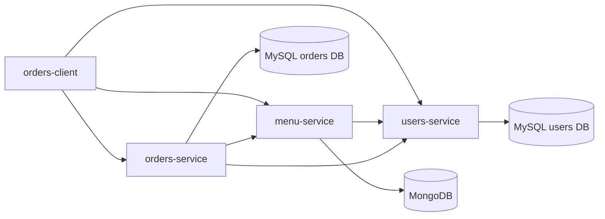

# Architecture Design

## 1. Task Summary

Design the first concrete architecture for a restaurant application platform with four deployables:

- `menu-service` in Java 21
- `orders-service` in Kotlin
- `users-service` in Kotlin
- `orders-client` in React

The initial scope is intentionally small, but the design must remain safe to scale into a broader microservice-based platform later.

## 2. Problem Statement

The repository currently contains only a generic scaffold. The requested restaurant platform introduces the first real product domain, so the architecture must do two things at once:

- solve the immediate functional needs for login, menu display, basket management, and order submission
- establish durable service boundaries, persistence ownership, and contracts that can scale without a rewrite

The main architectural challenge is to avoid building a monolith-by-accident while still keeping the first version simple enough to deliver quickly.

## 3. Affected Domain Flows

Relevant flows introduced by this design:

- `user_authentication`
- `menu_browsing`
- `order_submission`

Supporting domain references:

- `domain-brain/flows/user-authentication.md`
- `domain-brain/flows/menu-browsing.md`
- `domain-brain/flows/order-submission.md`
- `domain-brain/state-machines/order-lifecycle.md`

## 4. Constraints

- `menu-service` must be Java 21.
- `orders-service` and `users-service` must be Kotlin.
- All backend services must be API-first using OpenAPI as the source of truth.
- `menu-service` stores menu data in MongoDB.
- `orders-service` and `users-service` store data in MySQL and use Liquibase.
- `orders-service` must accept new orders with `PUT`.
- `users-service` must issue JWTs with a one-hour lifetime.
- Other backend services must call `users-service` to validate JWTs on each request in the initial design.
- The result must stay easy to split into implementation tasks.
- The repository currently has no concrete application code, so planned paths must be introduced cleanly.

## 5. Proposed Architecture

### 5.1 High-Level Shape

Use a monorepo with four independently deployable applications under `apps/`:

- `apps/menu-service`
- `apps/orders-service`
- `apps/users-service`
- `apps/orders-client`

Standardize backend runtime and operational concerns, but keep business logic and persistence separate per service:

- Spring Boot 3.x for all backend services
- Gradle with Kotlin DSL for backend builds across Java and Kotlin services
- OpenAPI definitions committed inside each app and used to generate controllers/interfaces and DTOs
- Docker-based local development with isolated service databases

This gives consistent operational behavior without creating a shared business-logic layer that would couple the services.

### 5.2 Service Boundaries

#### `users-service`

Owns:

- user credentials
- password verification
- JWT issuance
- JWT validation
- predefined demo users

Does not own:

- orders
- menu data

Primary responsibilities:

- authenticate with login/password
- return a signed JWT with a one-hour lifetime
- expose an internal validation endpoint used by other services

#### `menu-service`

Owns:

- menu item catalog
- menu item identifiers
- menu item display data

Does not own:

- orders
- users

Primary responsibilities:

- expose menu-read endpoints for the client
- expose an internal lookup endpoint for order validation
- persist menu items in MongoDB

#### `orders-service`

Owns:

- order intake
- order persistence
- order line snapshots
- order idempotency for `PUT` submissions

Does not own:

- user authentication
- menu catalog source of truth

Primary responsibilities:

- accept an order request
- validate bearer token with `users-service`
- verify `userId` in the request matches the validated token subject
- resolve item ids against `menu-service`
- persist an immutable order record in MySQL
- return the generated order id

#### `orders-client`

Owns:

- login UX
- token storage on the client
- menu browsing UI
- basket state
- order submission UX

Does not own:

- authorization decisions
- server-side totals or item validity

### 5.3 Request Flow



Flow details:

1. User opens `orders-client`.
2. Client shows login screen and calls `users-service`.
3. `users-service` verifies credentials and returns JWT plus expiry.
4. Client stores token and includes `Authorization: Bearer <token>` on every API call.
5. Client loads menu from `menu-service`.
6. `menu-service` validates the token through `users-service`, then returns menu items.
7. User builds basket locally in the client.
8. Client submits `PUT` order request to `orders-service` using a client-generated `requestId`.
9. `orders-service` validates the token through `users-service`.
10. `orders-service` validates menu item ids through `menu-service`.
11. `orders-service` stores the order and line snapshots in MySQL.
12. `orders-service` returns `orderId` to the client for confirmation.

### 5.4 Why `PUT` for New Orders

The requirement specifies `PUT` for order submission. To make that choice architecturally sound, use:

- `PUT /api/v1/orders/{requestId}`

Where:

- `requestId` is a client-generated UUID
- the server enforces uniqueness per authenticated user
- repeated requests with the same `requestId` return the same created order

This turns a non-typical create operation into an idempotent write, which is useful on flaky mobile networks and avoids duplicate orders on retries.

### 5.5 Initial and Future Architecture Positioning

For the first version:

- direct SPA-to-service calls
- synchronous REST-only backend interactions
- per-service databases
- no message broker
- no API gateway

Designed future evolution:

- replace synchronous token validation calls with local JWT verification via public keys or JWKS
- add an API gateway or BFF if edge policies and aggregation grow
- publish order events with an outbox when downstream consumers appear
- split menu read/write concerns or add admin backoffice later without moving order ownership

## 6. Components Affected

Planned application areas:

- `apps/menu-service`
- `apps/orders-service`
- `apps/users-service`
- `apps/orders-client`

Planned internal modules:

- `menu-service`: `api`, `application`, `domain`, `infrastructure`
- `orders-service`: `api`, `application`, `domain`, `persistence`, `clients`
- `users-service`: `api`, `application`, `security`, `persistence`
- `orders-client`: `features/auth`, `features/menu`, `features/basket`, `features/orders`, `shared/api`

Planned data stores:

- MongoDB database for menu catalog
- MySQL database for orders
- MySQL database for users

Operational components to include from the start:

- structured JSON logging
- health endpoints
- correlation/request ids
- metrics endpoints

## 7. Data Model / Ownership

### 7.1 Menu Ownership

`menu-service` owns `MenuItem`.

Required fields:

- `id: long`
- `name: string`
- `description: string`
- `price: double` in the public API

Persistence guidance:

- store `id` as a long, not Mongo `ObjectId`
- use a Mongo sequence/counter collection to generate longs
- store `price` in Mongo as `Decimal128` even if the API exposes `double`

Reasoning:

- the user explicitly requested long ids and double in the API
- persistence should still avoid floating-point drift where possible

### 7.2 Order Ownership

`orders-service` owns:

- `Order`
- `OrderLine`

Recommended persisted shape:

- `orders`
  - `id BIGINT`
  - `external_request_id VARCHAR`
  - `user_id BIGINT`
  - `status VARCHAR`
  - `total_amount DECIMAL(12,2)`
  - `created_at TIMESTAMP`
- `order_lines`
  - `id BIGINT`
  - `order_id BIGINT`
  - `menu_item_id BIGINT`
  - `menu_item_name VARCHAR`
  - `unit_price DECIMAL(10,2)`
  - `quantity INT`
  - `line_total DECIMAL(12,2)`

Important design choice:

- store a snapshot of `menu_item_name` and `unit_price` at order time

This prevents historical order totals from changing if menu items are renamed or repriced later.

### 7.3 User Ownership

`users-service` owns:

- `UserAccount`
- password hash
- role set
- token issuance policy

Recommended table shape:

- `users`
  - `id BIGINT`
  - `login VARCHAR UNIQUE`
  - `password_hash VARCHAR`
  - `status VARCHAR`
  - `roles VARCHAR`
  - `created_at TIMESTAMP`
  - `updated_at TIMESTAMP`

The first version seeds five predefined users through Liquibase data changelogs.

## 8. Interfaces

### 8.1 `users-service` external API

`POST /api/v1/auth/login`

Request:

```json
{
  "login": "demo-user",
  "password": "secret"
}
```

Response:

```json
{
  "accessToken": "jwt",
  "tokenType": "Bearer",
  "expiresInSeconds": 3600,
  "user": {
    "id": 1001,
    "login": "demo-user"
  }
}
```

### 8.2 `users-service` validation API

`POST /api/v1/internal/auth/validate`

Behavior:

- accepts the bearer token to validate
- requires a service-to-service credential from `menu-service` or `orders-service`
- verifies signature, expiry, and user status
- returns token subject and claims required by downstream services

Response example:

```json
{
  "valid": true,
  "userId": 1001,
  "login": "demo-user",
  "roles": [
    "CUSTOMER"
  ],
  "expiresAt": "2026-03-11T13:00:00Z"
}
```

### 8.3 `menu-service` public API

`GET /api/v1/menu-items`

Response:

```json
{
  "items": [
    {
      "id": 1,
      "name": "Margherita Pizza",
      "description": "Tomato, mozzarella, basil",
      "price": 12.5
    }
  ]
}
```

Initial scope is read-only. Menu management can be added later as admin endpoints without changing consumer-facing read contracts.

### 8.4 `menu-service` internal validation API

`POST /api/v1/internal/menu-items/resolve`

Request:

```json
{
  "itemIds": [
    1,
    2,
    5
  ]
}
```

Response:

```json
{
  "items": [
    {
      "id": 1,
      "name": "Margherita Pizza",
      "price": 12.5
    }
  ],
  "missingItemIds": [
    5
  ]
}
```

This endpoint exists so `orders-service` can validate order input without reading MongoDB directly.

Security requirements:

- requires a service-to-service credential from `orders-service`
- is not callable from the browser tier

### 8.5 `orders-service` API

`PUT /api/v1/orders/{requestId}`

Request:

```json
{
  "userId": 1001,
  "items": [
    {
      "itemId": 1,
      "quantity": 2
    },
    {
      "itemId": 1,
      "quantity": 1
    },
    {
      "itemId": 2,
      "quantity": 3
    }
  ]
}
```

Response on first successful creation:

```json
{
  "orderId": 900001,
  "requestId": "0d163888-2a26-4e1d-a5c1-810d402bcad4",
  "status": "ACCEPTED",
  "totalAmount": 62.5
}
```

Contract notes:

- multiple lines may reference the same `itemId`
- each line has an explicit quantity
- an empty item list is invalid
- `userId` in the body must match the validated JWT subject

### 8.6 OpenAPI-First Enforcement

Each service should keep its contract in:

- `apps/<service>/api/openapi.yaml`

Generation rules:

- server interfaces/controllers and DTOs are generated from the service contract
- `orders-client` consumes generated TypeScript clients
- `orders-service` consumes a generated client for the `menu-service` internal lookup contract
- `menu-service` and `orders-service` consume a generated client for the `users-service` validation contract

## 9. Reliability / Performance Considerations

### 9.1 Token Validation Dependency

Calling `users-service` on every protected request is simple and matches the requirement, but it creates:

- extra network latency
- a runtime dependency from `menu-service` and `orders-service` to `users-service`
- a potential central bottleneck

Initial mitigation:

- short downstream timeouts
- fail closed on validation failure
- standardized validation client library inside each backend service
- require service-to-service credentials on validation calls
- readiness checks that surface dependency health

Planned evolution:

- move to local JWT signature verification using a public key or JWKS
- keep `users-service` for login, user status changes, and exceptional introspection only

### 9.2 Order Submission Reliability

Use idempotent `PUT` with `requestId` so retries do not create duplicate orders.

Database constraints:

- unique key on `(user_id, external_request_id)`

### 9.3 Menu Lookup and Consistency

`orders-service` must validate menu item ids at submission time and persist item snapshots. This gives:

- immediate rejection for invalid or removed menu ids
- stable historical order contents after menu changes

### 9.4 Database Isolation

Do not share schemas or collections across services.

Initial deployment can use:

- one MongoDB instance for `menu-service`
- one MySQL server with separate logical databases for `orders-service` and `users-service`

Later scaling can move each store to independent managed infrastructure without changing service contracts.

### 9.5 Observability

Include from the first implementation:

- request correlation ids propagated across services
- structured logs
- metrics for auth validation latency, menu lookup latency, and order creation success/failure
- audit-level logging for login attempts and accepted orders

## 10. Security / Integrity Considerations

- JWT lifetime is exactly one hour.
- Passwords are stored only as strong hashes, never plaintext.
- `orders-service` must not trust the `userId` in the body unless it matches the validated token subject.
- `menu-service` and `orders-service` must reject missing, invalid, or expired bearer tokens.
- Internal endpoints such as `/api/v1/internal/auth/validate` and `/api/v1/internal/menu-items/resolve` require service-to-service credentials and must not be exposed to browsers directly.
- CORS should allow only the `orders-client` origin in non-local environments.
- Use HTTPS in any non-local deployment.
- The initial internal trust mechanism can be a shared service token over private networking, but the interface should be isolated so it can later move to mTLS or OAuth client credentials.
- Avoid storing the JWT in long-lived browser storage if possible; prefer memory with `sessionStorage` fallback for refresh tolerance in the first SPA version.

## 11. Trade-offs and Alternatives

### Chosen: Separate services now

Why:

- matches the requested future direction toward microservices
- keeps data ownership clear
- prevents user, menu, and order concerns from coupling early

Rejected alternative:

- single backend application with modules

Reason rejected:

- faster initially, but it would weaken the explicit service boundaries the user asked to establish

### Chosen: Direct client-to-service calls in V1

Why:

- simplest initial deployment
- fewer moving parts while the domain is still small

Rejected alternative:

- API gateway or BFF from day one

Reason rejected:

- adds another deployable before there is enough edge aggregation or policy complexity to justify it

### Chosen: JWT validation through `users-service` in V1

Why:

- explicit user requirement
- simplest security model to explain and implement initially

Rejected alternative:

- local JWT verification only

Reason rejected:

- conflicts with the stated requirement for downstream services to call `users-service` on each request

### Chosen: MongoDB for menu

Why:

- fits a flexible catalog model
- keeps menu independent from order persistence

Rejected alternative:

- MySQL for everything

Reason rejected:

- valid technically, but it removes an intentional service/data-store separation already requested for the menu domain

## 12. Implementation Guidance for Planner

Suggested implementation order:

1. Create monorepo application skeletons and shared backend conventions.
2. Implement `users-service` first because all protected flows depend on authentication.
3. Implement `menu-service` second with read API and seeded menu items.
4. Implement `orders-service` third with idempotent `PUT`, menu validation, and persistence.
5. Implement `orders-client` last against generated clients from the existing backend contracts.
6. Add local integration environment and end-to-end checks after all four applications exist.

Suggested task split:

1. Repository/bootstrap task
   - create app directories
   - standardize Gradle and frontend tooling
   - add OpenAPI generation conventions
2. `users-service`
   - OpenAPI contract
   - Liquibase schema
   - predefined users seed data
   - JWT issue/validate flows
   - security tests
3. `menu-service`
   - OpenAPI contract
   - Mongo configuration
   - long-id generation
   - read endpoints
   - internal resolve endpoint
4. `orders-service`
   - OpenAPI contract
   - Liquibase schema
   - idempotent order creation
   - menu lookup client
   - token validation client
   - persistence and contract tests
5. `orders-client`
   - login page
   - token storage strategy
   - menu catalog page
   - basket interactions
   - order confirmation view
   - responsive design
6. Cross-cutting validation
   - Docker Compose
   - integration tests
   - observability baseline

Required tests once implementation begins:

- OpenAPI generation verification in CI
- unit tests for auth, order totals, and idempotency
- integration tests for Liquibase and Mongo/MySQL repositories
- contract tests for service-to-service clients
- end-to-end test for login -> menu -> basket -> order submission

Rollout guidance:

- keep seeded demo users and demo menu data only for local/dev environments
- externalize JWT signing keys and database credentials immediately, even in the first implementation

## 13. Required Documentation Updates

Required updates completed as part of this architecture task:

- `domain-brain/flows/user-authentication.md`
- `domain-brain/flows/menu-browsing.md`
- `domain-brain/flows/order-submission.md`
- `domain-brain/entities/menu-item.md`
- `domain-brain/entities/order.md`
- `domain-brain/entities/user-account.md`
- `domain-brain/entities/basket.md`
- `domain-brain/entities/access-token.md`
- `domain-brain/state-machines/order-lifecycle.md`
- `domain-brain/invariants.md`
- `domain-brain/glossary.md`
- `domain-brain/edge-cases.md`
- `flow-index.yaml`

## 14. Open Questions

- Should the first implementation include only customer login, or do you also want admin/operator roles for future menu management now?
- Are predefined user passwords allowed to exist as local-development defaults, or must even demo passwords come only from environment-managed secrets?
- Do you want order totals to include taxes, service charges, or currency metadata in the first business version, or should the first version stay net-price only?
